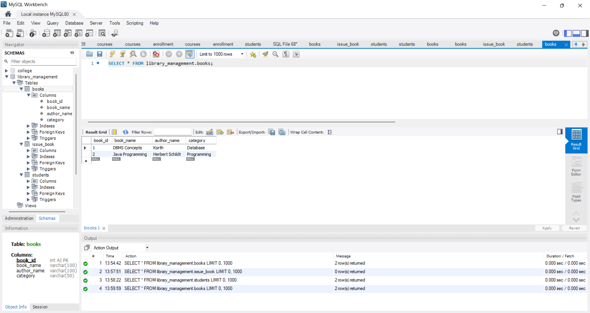
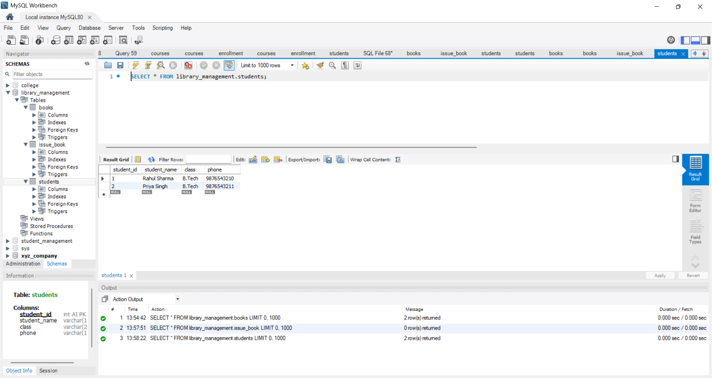

# Library Management System

A Library Management System database project developed using SQL.

## Features
- Book Management
- Student Records
- Issue and Return Books
- Fine Management

## Technologies Used
- SQL
- MySQL

## Author
Ashu
## Database Tables
- Books
- Students
- Transactions

## SQL Concepts Used
- Primary Key
- Foreign Key
- Joins
- Aggregate Functions
- CRUD Operations

## How to Run
1. Open MySQL Workbench.
2. Import library_management.sql.
3. Execute the script.
4. Run queries.

5. ## Screenshots

### Books Table

### Join Query Output

